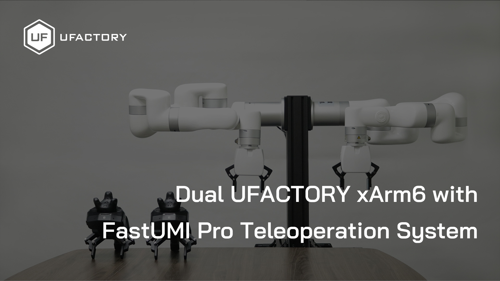
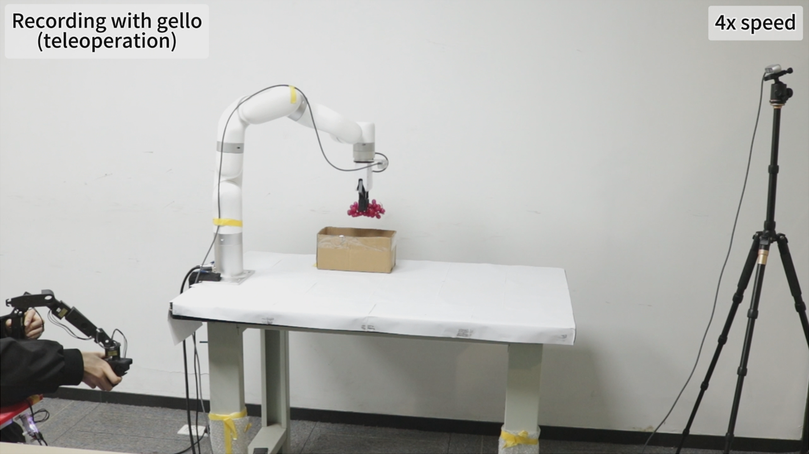

# UFACTORY Teleoperation System

This project provides teleoperation solutions for UFACTORY (深圳市众为创造科技有限公司) robotic arms, featuring four independent approaches:

1. **Pika Sense-based Teleoperation**: Utilizing Agilex Robotics' Pika Sense technology for precise motion tracking and control.
[](https://www.youtube.com/watch?v=D4L1dyyBriA)
2. **UMI Teleoperation**: Using FAST UMI devices for motion capture and control.
[](https://youtu.be/qlVHa8qA6oo)
3. **GELLO-inspired Framework**: Based on concepts from the open-source GELLO framework (https://wuphilipp.github.io/gello_site/)
[](https://www.youtube.com/watch?v=wTiWLiHciT8)
4. **PICO / OpenXR dual-arm teleoperation**: Uses GSPlayground UDP or XRoboToolkit to read PICO4 Ultra Enterprise HMD/controller poses for dual-xArm control.

## Overview

The UFACTORY Teleoperation System enables intuitive remote control of UFACTORY robotic arms through advanced motion tracking technologies. These systems are designed to lower the barrier to collecting high-quality demonstration data for robotic learning and manipulation tasks.

## Project Structure

```
ufactory_teleop/
├── ufactory_devices/         # Shared core library
│   ├── transformations.py    # Pose math (quaternion, RPY, axis-angle, homogeneous matrices)
│   ├── robot/                # xArm robot wrapper (connection, motion, gripper control)
│   ├── pika/                 # Pika Sense & Pika Gripper serial driver
│   ├── umi/                  # UMI device SDK bindings (XVLib via ctypes) and HTC Vive Tracker driver (pysurvive)
├── pika_teleop/              # Pika Sense teleoperation solution
│   ├── uf_robot_pika_teleop.py
│   ├── calibrate.py
│   ├── config/
│   └── rules/
├── umi_teleop/               # UMI teleoperation solution
│   ├── uf_robot_umi_teleop.py
│   ├── uf_robot_umi_teleop_dual.py
│   ├── calibrate.py
│   ├── config/
│   ├── rules/
│   └── xvsdk/
├── pico_teleop/              # PICO / OpenXR dual-arm teleoperation solution
│   ├── uf_robot_pico_teleop_dual.py
│   ├── pico_xr_client.py
│   ├── xrobotoolkit_xr_client.py
│   └── config/
└── gello_teleop/             # Gello teleoperation solution
    ├── uf_robot_gello_teleop.py
    ├── config/
    └── rules/
```

## Teleoperation Solutions

### Pika Sense-based Solution

Uses Agilex Robotics' Pika Sense — a handheld clamp controller with integrated Vive Tracker mount — to capture 6-DOF hand motion and map it to robot end-effector movement in real time.

- **Tracking**: HTC Vive Tracker + Lighthouse base stations (via Pika SDK)
- **Control**: Single-arm teleoperation with command-state toggle (clamp open/close to start/stop)
- **Gripper Support**: Pika Gripper, xArm Gripper (G1/G2), BIO Gripper G2, Robotiq Gripper
- **Motion Modes**: Servo Cartesian (mode 1) and online trajectory planning (mode 7)

For details, see [pika_teleop/README.md](pika_teleop/README.md).

### UMI Teleoperation Solution

Using FastUMI for intuitive teleoperation. Supports both single-arm and dual-arm setups with flexible tracking options.

- **Tracking**: UMI built-in SLAM or HTC Vive Tracker + Lighthouse base stations (configurable)
- **Control**: Single-arm (`uf_robot_umi_teleop.py`) and dual-arm (`uf_robot_umi_teleop_dual.py`) teleoperation
- **Gripper Support**: xArm Gripper G2, xArm Gripper, BIO Gripper G2, Pika Gripper, Robotiq Gripper
- **Motion Modes**: Servo Cartesian (mode 1) and online trajectory planning (mode 7)
- **Dual-Arm**: Two UMI devices control two xArm robots simultaneously via independent threads

For details, see [umi_teleop/README.md](umi_teleop/README.md).

### PICO / OpenXR Dual-Arm Teleoperation

Uses a PICO4 Ultra Enterprise or another OpenXR device to read HMD, left-controller, and right-controller 6-DOF poses plus controller buttons. It supports the GSPlayground UDP backend and an XRoboToolkit backend for single-Ubuntu PICO-to-xArm deployment.

- **Tracking**: Unity OpenXR + UDP pose stream, or XRoboToolkit PICO App + Ubuntu PC Service
- **Control**: Dual-arm Cartesian end-effector teleoperation
- **Gripper Support**: Left/right triggers control left/right grippers
- **Deadman Control**: By default, each arm only moves while that controller's grip is held

For details, see [pico_teleop/README_ZH.md](pico_teleop/README_ZH.md).

### Gello Teleoperation Solution

A joint-space teleoperation system using the Gello leader arm (Dynamixel servo-based haptic input device) to control xArm robots. Joint positions are read via serial port, and auto-offset calibration maps them to robot target joint angles.

- **Control Space**: Joint space (robot_mode: 6), directly mapping leader arm joint motion
- **Supported Robots**: xArm5, xArm6, xArm7 (with corresponding example configs)
- **Joint Mapping**: Configurable via `joint_ids` and `joint_signs` for flexible Gello-to-robot mapping
- **Auto-Offset**: Automatically reads Gello's current pose at startup and computes joint offsets
- **Torque Mode**: Unmapped Dynamixel joints can be held via `torque_joint_ids` with torque enabled
- **Gripper Support**: Optional Gello-side Dynamixel gripper, supports xArm Gripper (G1/G2), Pika Gripper, Robotiq Gripper

For details, see [gello_teleop/README.md](gello_teleop/README.md).

## Features

- **Intuitive Control**: Direct manipulation interfaces that reduce the gap between user and robot embodiment
- **Cost-Effective**: Leverages commercially available tracking technologies and off-the-shelf components
- **High-Quality Demonstrations**: Enables collection of precise demonstration data for imitation learning
- **Multi-Robot Support**: Compatible with various UFACTORY robotic arm models (xArm 5/6/7, Lite 6, 850)
- **Flexible Gripper Options**: Supports xArm Gripper (G1/G2), BIO Gripper G2, Pika Gripper, and Robotiq Gripper
- **Dual-Arm Operation**: UMI solution supports synchronized dual-arm teleoperation for bimanual tasks

## Getting Started

### Pika Sense-based Teleoperation

Please refer to the detailed documentation in [pika_teleop/README.md](pika_teleop/README.md).

Quick start:

```bash
git clone https://github.com/xArm-Developer/ufactory_teleop
cd ufactory_teleop/pika_teleop
conda create --name py39 python=3.9
conda activate py39
pip install -r requirements.txt
pip install pysurvive agx-pypika --no-deps
sudo cp rules/*.rules /etc/udev/rules.d/
sudo udevadm control --reload-rules && sudo udevadm trigger
python uf_robot_pika_teleop.py --config config/xarm6_pika_teleop.yaml
```

### UMI Teleoperation

Please refer to the detailed documentation in [umi_teleop/README.md](umi_teleop/README.md).

Quick start (single arm):

```bash
cd ufactory_teleop/umi_teleop
conda create --name py39 python=3.9
conda activate py39
sudo dpkg -i xvsdk/XVSDK_focal_amd64.deb
sudo apt install -y --fix-broken
pip install -r requirements.txt
pip install pysurvive agx-pypika --no-deps
sudo cp rules/*.rules /etc/udev/rules.d/
sudo udevadm control --reload-rules && sudo udevadm trigger
python uf_robot_umi_teleop.py --config config/xarm6_umi_teleop.yaml
```

Quick start (dual arm):

```bash
python uf_robot_umi_teleop_dual.py --config config/xarm6_umi_teleop_dual.yaml
```

### PICO / OpenXR Dual-Arm Teleoperation

Quick start with XRoboToolkit simulation:

```bash
cd ufactory_teleop/pico_teleop
pip install -r requirements-sim.txt

# 1. Confirm the PICO/XRoboToolkit stream first.
python inspect_xrobotoolkit_stream.py --hz 5

# 2. Run the full teleoperation workflow without connecting real xArm robots.
python uf_robot_pico_teleop_dual.py \
  --config config/xarm7_xrobotoolkit_teleop_dual.yaml \
  --sim \
  --sim-viewer console \
  --sim-print-hz 5

# 3. Optional: use MuJoCo to see the xArm7 model and live target frames.
python uf_robot_pico_teleop_dual.py \
  --config config/xarm7_xrobotoolkit_teleop_dual.yaml \
  --sim \
  --sim-viewer mujoco \
  --sim-mujoco-arm both
```

Expected stream-check output:

- `ts` is nonzero and increasing.
- `robot_xyz_m` is finite, not `nan`.
- Left/right `grip`, `trigger`, and buttons change when operated.

Simulation workflow:

1. Start XRoboToolkit PC Service and connect the PICO XRoboToolkit app.
2. Run `inspect_xrobotoolkit_stream.py --hz 5` and stop it before running teleop.
3. Run the sim command above.
4. Hold both controllers in a stable neutral start pose, then press Enter.
5. Squeeze a controller side grip to enable that arm. The console should change from `target=inactive` to `target=[...]`.
6. Move each controller slowly and verify the target TCP position changes smoothly.
7. Pull each trigger and verify `gripper=` changes from `0.00` toward `1.00`.
8. Press right-controller `A` to recalibrate the controller reference pose. This resets the mapping to the configured default `robot_base_pose`, not the arm's current TCP pose; in sim, the fake robot state is reset to that default pose. The example default pose is `[350, 0, 250, 3.141593, 0, -1.570796]`, which points the TCP/tool Z axis vertically down toward the ground.
9. Press right-controller `B` to stop cleanly.

`--sim-viewer mujoco` loads the MuJoCo Menagerie xArm7 model through `robot_descriptions`. The first run may download and cache the model assets. The viewer displays two xArm7 models, one for the left target and one for the right target, with a small visual Y offset so they do not overlap. Both models follow their live target TCP position and orientation using pose IK. `--sim-mujoco-arm left|right|both` is kept as a camera/focus hint; it does not hide the other arm.

Direction check: the XRoboToolkit backend converts OpenXR poses to `x=front, y=left, z=up`, matching the SteamVR/OpenXR convention used in Genesis-Humanoid. PICO teleop then maps controller translation as a world-frame delta by default (`position_delta_frame: "world"`), so controller `+x/+y/+z` should move the target TCP in robot `+x/+y/+z`. Wrist rotation remains a relative orientation delta from the calibrated pose. Releasing grip pauses motion commands but keeps the calibrated reference; press right-controller `A` whenever you want to reset the reference.

After the simulated workflow is validated, run real robot mode:

```bash
python uf_robot_pico_teleop_dual.py --config config/xarm7_xrobotoolkit_teleop_dual.yaml
```

### Gello Teleoperation

Please refer to the detailed documentation in [gello_teleop/README.md](gello_teleop/README.md).

Quick start:

```bash
cd ufactory_teleop/gello_teleop
conda create --name py39 python=3.9
conda activate py39
pip install -r requirements.txt
pip install pysurvive agx-pypika --no-deps
sudo usermod -aG dialout $USER
# Re-login then run
python uf_robot_gello_teleop.py --config config/xarm7_gello_teleop.yaml
```

## References

- [Agilex Robotics Pika Sense](https://global.agilex.ai/products/pika)
- [UFACTORY Robotic Arms](https://www.ufactory.cc/xarm-collaborative-robot/)
- [LuMos FastUMI](https://www.fastumi.com/)
- [GELLO: General Low-Cost Teleoperation Framework](https://wuphilipp.github.io/gello_site/)
